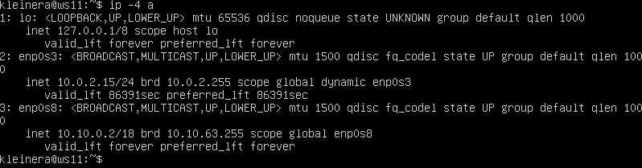
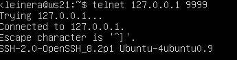

# Сети в Linux

## Part 1. Инструмент ipcalc

### 1.1 Сети и маски
  
+ ***1.***
  
  ***Адрес сети 192.167.38.54/13***

  
  
+ ***2.*** 
  
  ***Перевод маски 255.255.255.0 в префиксную и двоичную запись***
  
  ***В префиксной равен 24, тк состаляет 3 полных октета (3 * 8)***
   
  ***В двоичной:***

  
  
  ***/15 в обычной и двоичночной***
  
  ***В обычной равен 255.254.0.0, т.к 1 полный октет и 254 = 7 (без конечной 1)***
  
  ***В двоичной равен (11111111.11111110.0.0), без той самой единицы***
  
  
  
  ***11111111.11111111.11111111.11110000 в обычную и префиксную***
  
  ***В обычной равен 255.255.255.240***
  
  ***В префиксой равен 28, тк 3 полных октета и 240 = 4 (16 = 4, 8 -4 = 4)***
  
  
  
+ ***3.***

  ***Минимальный и максимальный хост в сети 12.167.38.4 при масках: /8, 11111111.11111111.00000000.00000000, 255.255.254.0 и /4***
  
  
  
### 1.2 localhost
  
+ ***Определить и записать в отчёт, можно ли обратиться к приложению, работающему на localhost, со следующими IP: 194.34.23.100, 127.0.0.2, 127.1.0.1, 128.0.0.1***

  ***194.34.23.100 - нет***

  ***127.0.0.2 - да***

  ***127.1.0.1 - да***

  ***128.0.0.1 - нет***

### 1.3 Диапазоны и сегменты сетей
  
  ***Какие из перечисленных IP можно использовать в качестве публичного, а какие только в качестве частных: 10.0.0.45, 134.43.0.2, 192.168.4.2, 172.20.250.4, 172.0.2.1, 192.172.0.1, 172.68.0.2, 172.16.255.255, 10.10.10.10, 192.169.168.1***

  

  ***Какие из перечисленных IP адресов шлюза возможны у сети 10.10.0.0/18: 10.0.0.1, 10.10.0.2, 10.10.10.10, 10.10.100.1, 10.10.1.255***

  

  ***Поэтому возможны только [10.10.0.2] [10.10.10.10] [10.10.1.255]***

## Part 2. Статическая маршрутизация между двумя машинами

+ ***ip a для ws1, ws2***
  
  

+ ***Описан сетевой интерфейс, соответствующий внутренней сети, на обеих машинах и заданы следующие адреса и маски: ws1 - 192.168.100.10, маска /16, ws2 - 172.24.116.8, маска /12***
  
  

+ ***Вызов команды netplan apply***
  
  

### 2.1. Добавление статического маршрута вручную

+ ***Добавление статического маршрута, пропинговка***
  
  

### 2.2. Добавление статического маршрута с сохранением

+ ***Добавление статического маршрута и пропинговка без команды ip r add и пропинговка***
  
  

  

## Part 3. Утилита iperf3

### 3.1. Скорость соединения

+ ***Перевести и записать в отчёт: 8 Mbps в MB/s, 100 MB/s в Kbps, 1 Gbps в Mbps***
  
  ***8 Mbps = 1 MB/s***

  ***100 MB/s = 819200 Kbps***

  ***1 Gbps = 1024 Mbps***

### 3.2. Утилита iperf3

+ ***Измерить скорость соединения между ws1 и ws2***
  
  

## Part 4. Сетевой экран

### 4.1. Утилита iptables

+ ***Нужно добавить в файл подряд следующие правила:***
  
  ***1) на ws1 применить стратегию когда в начале пишется запрещающее правило, а в конце пишется разрешающее правило (это касается пунктов 4 и 5)***

  ***2) на ws2 применить стратегию когда в начале пишется разрешающее правило, а в конце пишется запрещающее правило (это касается пунктов 4 и 5)***

  ***3) открыть на машинах доступ для порта 22 (ssh) и порта 80 (http)***

  ***4) запретить echo reply (машина не должна "пинговаться”, т.е. должна быть блокировка на OUTPUT)***

  ***5) разрешить echo reply (машина должна "пинговаться")***

  ***Правила для первой и второй машин***

  

  ***Даем разрешение на использование скрипта, после чего пропинговываем IP ws2 (успешная пропинговка), и пропинговываем IP ws1 (пропинговка блокируется)***

  

  ***Разница заключается в следующем - файл читается сверху-вниз, у ws1 стоит первым правилом проверка на пропинговку своего IP (DROP), вторым правилом стоит на проинговку второй (ACCEPT), аналогично у ws2, только правила поменены местами, иначе говоря - это все приоритет.***

### 4.2. Утилита nmap

+ ***Командой ping найти машину, которая не "пингуется", после чего утилитой nmap показать, что хост машины запущен***
  
  

  ***На скрине видно, что вторая пингуется (все окей), первая не пингуется (все окей), прописываем nmap у первой, видимо надпись "Host is up", прописываем nmap у ws2 с IP ws1 - надпись "Host is up".***

## Part 5. Статическая маршрутизация сети

### 5.1. Настройка адресов машин

***Cкрины с содержанием файла etc/netplan/00-installer-config.yaml для каждой машины:***

+ ***WS11***
  
  

+ ***WS21***
  
  

+ ***WS22***
  
  

+ ***r1***
  
  

+ ***r2***
  
  

***Перезапустить сервис сети. Если ошибок нет, то командой ip -4 a проверить, что адрес машины задан верно.***

+ ***WS11***
  
  

+ ***WS21***
  
  

+ ***WS22***
  
  

+ ***r1***
  
  

+ ***r2***
  
  

***Пропинговать ws22 с ws21. Аналогично пропинговать r1 с ws11.***

+ ***Пропинговка ws22 с ws21***
  
  

+ ***Пропинговка r1 с ws11***
  
  

### 5.2. Включение переадресации IP-адресов.

+ ***Использование команды "sysctl -w net.ipv4.ip_forward=1" в r1 и r2***
  
  

+ ***Добавление строчки "net.ipv4.ip_forward=1" в "/etc/sysctl.conf"***

  

### 5.3. Установка маршрута по-умолчанию

+ ***Настроить маршрут по-умолчанию (шлюз) для рабочих станций. Для этого добавить default перед IP роутера в файле конфигураций***
  
  ***WS11 Netplan***
  
  

  ***WS21 Netplan***
  
  

  ***WS22 Netplan***
  
  

+ ***Вызов ip r для станций***
  
  ***WS11 ip r***

  

  ***WS21 ip r***

  

  ***WS22 ip r***

  

+ ***Пропинговка r2 с ws11***
  
  

### 5.4. Добавление статических маршрутов

+ ***netplan r1/r2***
  
  

+ ***ip r r1/r2***
  
  

+ ***ip r list 10.10.0.0/[маска сети] и ip r list 0.0.0.0/0***
  
  

+ ***Для адреса 10.10.0.0/18 был выбран маршрут, отличный от 0.0.0.0/0, потому что при наличии нескольких маршрутов одинаковой длины выбирается тот маршрут, который задан наиболее точно.***

### 5.5. Построение списка маршрутизаторов

+ ***Вывод команд traceroute и tcpdump***
  
  

  ***Утилита Traceroute вместо ICMP-запроса отправляет 3 UDP-пакета на определенный порт целевого хоста и ожидает ответа о недоступности этого порта. Первый пакет отправляется с TTL=1, второй с TTL=2 и так далее, пока запрос не попадёт адресату. Так как вместо ICMP-запроса он отправляет UDP-запрос, в каждом запросе есть порт отправителя и порт получателя. По умолчанию запрос отправляется на закрытый порт 34434. Когда запрос попадёт на хост назначения, этот хост отправит ответ о недоступности порта «Destination port unreachable» (порт назначения недоступен). Это значит, что адресат получил запрос. Traceroute воспримет этот ответ как завершение трассировки.***

### 5.6. Использование протокола ICMP при маршрутизации

+ ***Пинг несуществующего ip, дамп с r1***
  
  

## Part 6. Динамическая настройка IP с помощью DHCP

+ ***Для r2 настроить в файле /etc/dhcp/dhcpd.conf конфигурацию службы DHCP:***
  
  ***1) указать адрес маршрутизатора по-умолчанию, DNS-сервер и адрес внутренней сети.***

  

  ***2) в файле resolv.conf прописать nameserver 8.8.8.8.***

  

+ ***Перезагрузить службу DHCP командой systemctl restart isc-dhcp-server.***
  
  

+ ***Машину ws21 перезагрузить при помощи reboot и через ip a показать, что она получила адрес.***
  
  

+ ***Также пропинговать ws22 с ws21.***
  
  

+ ***Указать MAC адрес у ws11, для этого в etc/netplan/00-installer-config.yaml надо добавить строки: macaddress: 10:10:10:10:10:BA, dhcp4: true***
  
  

+ ***Для r1 настроить аналогично r2, но сделать выдачу адресов с жесткой привязкой к MAC-адресу (ws11). Провести аналогичные тесты***
  
  ***dhcp.conf r1***

  

  ***resolv.conf r1***
  
  

  ***restart для r1***
  
  

  ***Ребутаемся и проверяемся(все ок)***

  

+ ***Запросить с ws21 обновление ip адреса***
  
  ***Было по ip a***

  

  ***Использова dhclient -r и вывод ip a***

  

+ ***Какими опциями DHCP сервера пользовались в данном пункте:***
  
  ***Настройка конфигурации службы DHCP (адрес маршрутизатора по-умолчанию, DNS-сервер, адрес внутренней сети, привязка к MAC-адресу)***

  ***Клиент протокола динамической конфигурации хоста (команда dhclient) для обновления или освобождения IP-адреса***

## Part 7. NAT

+ ***В файле /etc/apache2/ports.conf на ws22 и r1 изменить строку Listen 80 на Listen 0.0.0.0:80, то есть сделать сервер Apache2 общедоступным***
  
  

+ ***Запустить веб-сервер Apache командой service apache2 start на ws22 и r1***
  
  

+ ***Добавить в фаервол, созданный по аналогии с фаерволом из Части 4, на r2 следующие правила:***
  
  ***1) удаление правил в таблице filter - iptables -F***
  
  ***2) удаление правил в таблице "NAT" - iptables -F -t nat***

  ***3) отбрасывать все маршрутизируемые пакеты - iptables --policy FORWARD DROP***

  

+ ***Запуск /etc/firewall.sh на r2, а также проверка соединения между ws22 и r1(пропинговка с r1 не пропинговывается, все ок)***
  
  

+ ***Разрешаем маршрутизацию всех пакетов протокола ICMP, после чего пропинговываем c r1 ws22***
  
  

+ ***Добавить в файл ещё два правила:***
  
  ***5) включить SNAT, а именно маскирование всех локальных ip из локальной сети, находящейся за r2 (по обозначениям из Части 5 - сеть 10.20.0.0)***

  ***6) включить DNAT на 8080 порт машины r2 и добавить к веб-серверу Apache, запущенному на ws22, доступ извне сети***

  

+ ***Проверка соединения по TCP для SNAT с ws22 на r1, а также проверка соединения по TCP для DNAT с r1 к ws22 (обращаемся по адресу r2 и порту 8080), (перед этим отключив NAT)***
  
  

### Part 8. Дополнительно. Знакомство с SSH Tunnels

+ ***Запускаем фаервол на r2***
  
+ ***Запускаем Apache на r2 на localhost:80***
  
  

+ ***Воспользоваться Local TCP forwarding с ws21 до ws22, чтобы получить доступ к веб-серверу на ws22 с ws21***
  
  

+ ***Воспользоваться Remote TCP forwarding c ws11 до ws22, чтобы получить доступ к веб-серверу на ws22 с ws11***
  
  

+ ***Для проверки, сработало ли подключение в обоих предыдущих пунктах, перейдите во второй терминал (например, клавишами Alt + F2) и выполните команду:***
  
  ***Проверяем на ws11***
  
  

  ***Проверяем на ws21***

  